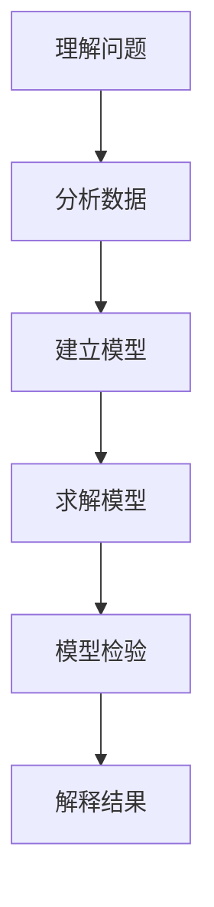
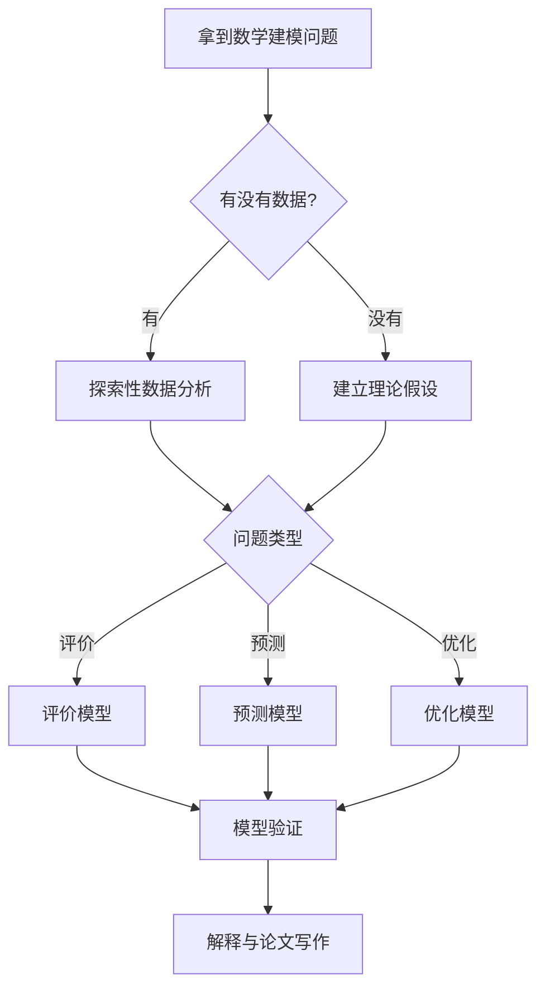

这是一份 Gud's Notebook 的 Markdown 写作速查表，同时用于测试网站中的常见内容组件。

---

## 1. 普通文本

普通段落直接使用 Markdown 编写。

**粗体**

*斜体*

~~删除线~~

[链接示例](https://github.com/)

---

## 2. 行内代码

使用反引号：

`pd.read_excel()`

实际效果：

使用 `pd.read_excel()` 读取 Excel 文件。

---

## 3. 代码块

Python：

```python
import numpy as np
import pandas as pd

data = pd.DataFrame({
    "x": [1, 2, 3],
    "y": [2, 4, 6]
})

print(data)
```

C++：

```cpp
#include <iostream>

int main() {
    std::cout << "Hello, Gud's Notebook!" << std::endl;
    return 0;
}
```

---

## 4. 行内数学公式

写法：

`$E = mc^2$`

效果：

爱因斯坦质能方程为 $E = mc^2$。

对于函数 $f(x)=x^2$，其导数为 $f'(x)=2x$。

---

## 5. 块级数学公式

写法：

```text
$$
f(x)=ax^2+bx+c
$$
```

效果：

$$
f(x)=ax^2+bx+c
$$

例如二次方程求根公式：

$$
x =
\frac{-b\pm\sqrt{b^2-4ac}}
{2a}
$$

---

## 6. 矩阵

写法：

```text
$$
A =
\begin{bmatrix}
1 & 2 \\
3 & 4
\end{bmatrix}
$$
```

效果：

$$
A =
\begin{bmatrix}
1 & 2 \\
3 & 4
\end{bmatrix}
$$

---

## 7. 求和与积分

求和：

$$
S=\sum_{i=1}^{n}x_i
$$

积分：

$$
F(x)=\int_a^b f(x)\,dx
$$

极限：

$$
\lim_{n\to\infty}
\left(1+\frac{1}{n}\right)^n=e
$$

---

## 8. 普通引用

写法：

```markdown
> 数学建模的重点不是模型越复杂越好，而是模型是否适合问题。
```

效果：

> 数学建模的重点不是模型越复杂越好，而是模型是否适合问题。

---

## 9. Tip

写法：

```markdown
> ##### TIP
>
> 这是一个值得记住的技巧。
{: .block-tip }
```

实际效果：

> ##### TIP
>
> 这是一个值得记住的技巧。
{: .block-tip }

适合：

- 方法技巧
- 推荐做法
- 经验总结

---

## 10. Warning

写法：

```markdown
> ##### WARNING
>
> 使用这个方法之前需要检查数据是否满足条件。
{: .block-warning }
```

效果：

> ##### WARNING
>
> 使用这个方法之前需要检查数据是否满足条件。
{: .block-warning }

适合：

- 常见错误
- 使用限制
- 容易忽略的前提

---

## 11. Danger

写法：

```markdown
> ##### DANGER
>
> 不能仅仅因为模型的拟合优度很高，就认为模型一定可靠。
{: .block-danger }
```

效果：

> ##### DANGER
>
> 不能仅仅因为模型的拟合优度很高，就认为模型一定可靠。
{: .block-danger }

适合：

- 严重错误
- 错误结论
- 高风险做法

---

## 12. 表格

写法：

```markdown
| 方法 | 优点 | 缺点 |
| --- | --- | --- |
| TOPSIS | 简单直观 | 权重影响较大 |
| AHP | 可解释性强 | 主观性较强 |
| 熵权法 | 客观赋权 | 依赖数据 |
```

效果：

| 方法 | 优点 | 缺点 |
| --- | --- | --- |
| TOPSIS | 简单直观 | 权重影响较大 |
| AHP | 可解释性强 | 主观性较强 |
| 熵权法 | 客观赋权 | 依赖数据 |

---

## 13. Mermaid 流程图

要使用 Mermaid，页面 Front Matter 必须包含：

```yaml
mermaid: true
```

写法：



---

## 14. Mermaid 决策流程



---

## 15. 折叠内容

HTML 的 `details` 标签可以用于隐藏较长内容。

写法：

```html
<details>
<summary>点击查看详细推导</summary>

这里可以放详细内容。

</details>
```

效果：

<details>
<summary>点击查看详细推导</summary>

这里可以放较长的数学推导、代码解释或者补充内容。

</details>

---

## 16. 键盘按键

写法：

```html
<kbd>Ctrl</kbd> + <kbd>C</kbd>
```

效果：

<kbd>Ctrl</kbd> + <kbd>C</kbd>

以及：

<kbd>Ctrl</kbd> + <kbd>Shift</kbd> + <kbd>P</kbd>

---

## 17. 推荐的数学建模笔记结构

以后模型笔记建议统一使用：

```text
问题是什么

↓

为什么使用这个模型

↓

模型假设

↓

数学原理

↓

建模流程

↓

代码实现

↓

结果解释

↓

模型检验

↓

优点

↓

缺点

↓

适用场景

↓

不适用场景

↓

我的理解
```

---

## 18. Front Matter 模板

普通数学建模文章：

```yaml
---
title: TOPSIS
category: modeling
group: evaluation
order: 1
---
```

需要 Mermaid：

```yaml
---
title: TOPSIS
category: modeling
group: evaluation
order: 1
mermaid: true
---
```

隐藏左侧导航：

```yaml
hide_in_nav: true
```

一级分类首页：

```yaml
nav_root: true
```

---

## 19. 最终原则

这个知识库中的笔记应该优先回答：

> 我为什么这样做？

其次才是：

> 代码应该怎么写？

最终希望每篇笔记都能够做到：

**问题 → 思路 → 原理 → 实现 → 验证 → 解释 → 总结**
